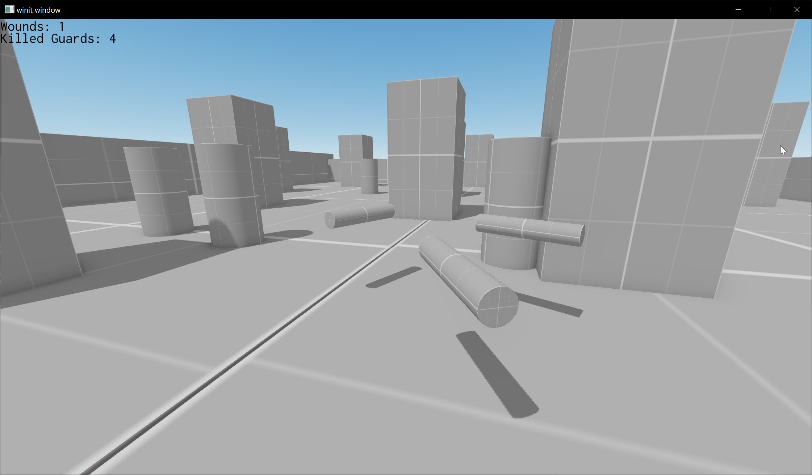

# About
Rudimental Game made with Fyrox Engine and https://github.com/kkolyan/fyrox_lite.

Lua port of https://github.com/kkolyan/fyrox_guards

Explored Fyrox APIs:
* Node graph.
* RigidBody (3D)
* Ray Casting
* Prefabs & Editor. Everything dynamic in game created in Editor and instantiated via prefabs, except UI, which is coded.

# How to run a game
```sh
git clone --recursive https://github.com/kkolyan/fyrox_lite_lua
chmod +x lua/examples/guards/play.sh
./lua/examples/guards/play.sh
```

# How to play
Use WASD and mouse to shoot enemies and optionally avoid their attacks.

# How to edit scenes
```sh
chmod +x lua/examples/guards/edit.sh
./lua/examples/guards/edit.sh
```

# How to edit scripts
Use any text editor to edit existing files under [scripts](scripts) directory. If you use VSCode, make sure that the [annotations](lua/annotations) are in the scope of the VSCode project, because it will provide some code insight (autocompletion, type checking, Fyrox Lite API reference). Though, it's optional and doesn't impact code execution.

# Screenshots
